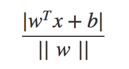

## 支持向量机
===

支持向量机（*Support Vector Machines, SVM*）。在介绍SVM之前，先解释几个概念：

- 线性可分：假设一个平面中有若凡个圆形与三角形，可以使用一条直线将两组数据点分开，那么叫做线性可分。
- 分隔超平面：上面提到的将数据集分开的直线，称为分隔超平面。
- 超平面：在上面的例子中，是一个平面，那如果是一个三维的，那么用来分割点的就是一个平面，如果是N维的的？这个玩意就被叫做超平面，也就是分类的决策边界。
- 间隔：数据点到分隔面的距离被称为间隔。一般情况下，我们希望间隔尽可能的大，这是因为如果我们犯错或者在有限的数据集上训练分类器的话，我们希望分类器尽可能健壮。
- 支持向量：离分隔超平面最近的那些点。

#### 寻找最大间隔

如果求解数据集的最佳分隔直线？分隔超平面的形式可以写成：

要计算点A到分隔超平面的距离，就必须给出点到分隔面的法线或垂线的长度，该值写为：

> `||w||`的意思是w向量的各个元素的平方和的开平方
> 这里的常数b类似于Logistic回归中的截距Wо。

这里的向量w和常数b一起描述了所给数据的分隔线或超平面，接下来我们讨论分类器。

###### 分类器求解的优化问题

前面已经提到了分类器，但还没有介绍它的工作原理。理解其工作原理将有助于理解基于优化问题的分类器求解过程。输入数据给分类器会输出一个类别标签，这相当于一个类似Sigmoid的函数在作用。下面将使用类似`海维塞德阶跃函数`的函数对分隔超平面的公式作用得到：

其中，当u<0时，f(u)输出-1，反之则输出+1。这和钱一张的Logistic回归有所不同，那里的类别标签是0或1。这里为什么呢？因为-1和+1仅差一个符号，便于数学上的处理。我们可以通过一个统一的公式来表示间隔或者数据点到分隔超平面的距离，同时不必担数据到底是属于-1还是+1类。

当计算数据点到分隔面的距离并确定分隔面的放置位置时，间隔通过：

来计算，这时候就能提现出-1和+1的好处了，如果数据点处于正方向并且离分隔超平面很远的位置时：

会是一个很大的正数，同时，上式也是一个很大的正数，而如果数据点处于负方向的-1类并且离分隔超平面很远的位置时，由于类别标签为-1，上式仍然是一个很大的正数。现在的目标就是找出分类器中的w和b。为此，我们必须找到具有最小间隔的数据点，而这些数据点也就是前面提到的支持向量。一旦找到具有最小间隔的数据点，我们就需要对该间隔最大化，这就可以写作：

直接求解上述问题相当困难，所以我们将它转换为另一种更容易求解的形式。首先考察一下上式中大括号内的部分。由于对乘积进行优化是一件很讨厌的事情，因此我们要做的是固定其中一个因子而最大化其他因子。如果另所有支持向量的

都等于1，只有那些离分隔超平面最近的点得到的值才为1。而离分隔超平面越远的数据点，值也就越大。

在上述优化问题中，给定了一些约束条件然后求最优值，因此该问题是一个带约束条件的优化问题。这里的约束条件就是：

对于这类优化问题，有一个非常著名的求解方法，即`拉格朗日乘子法`，通过引入`拉格朗日乘子`，我们就可以基于约束条件来表述原来的问题。由于这里的约束条件都是基于数据点的，因此我们就可以将超平面写成数据点的形式。于是，优化目标的函数最后可以写成：

> 尖括号内标识两个向量的乘积

其约束条件为：

至此，一切都很完美，但是这里有个假设：数据必须100%线性可分。目前为止，我们知道几乎所有数据都不会这样，这时我们就可以通过引入`松弛变量`，来允许有些数据点可以处于分隔面的错误一侧。这样我们的优化目标就能保持仍然不变，但是此时新的约束条件则变为：

这里的常数c用于控制"最大化间隔" 和 "保证大部分点的函数间隔小于1.0" 这两个目标的权重。在优化算法的实现代码中，常数C是一个参数，因此我们就可以通过调节该参数得到不同的结果。一旦求出了新的alpha，那么分隔超平面就可以通过这些alpha来表达。这一结论十分直接，SVM中的主要工作就是求解这些alpha。要理解刚才这些公式还需要大量的知识，如果你有兴趣，可以去搜索一下相关的推导过程。

###### SVM应用中的一般框架

